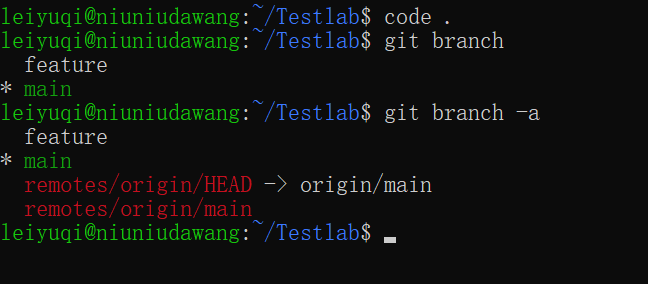
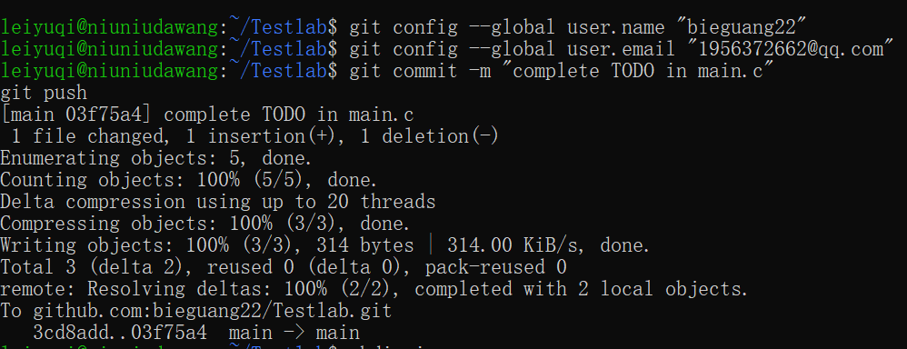
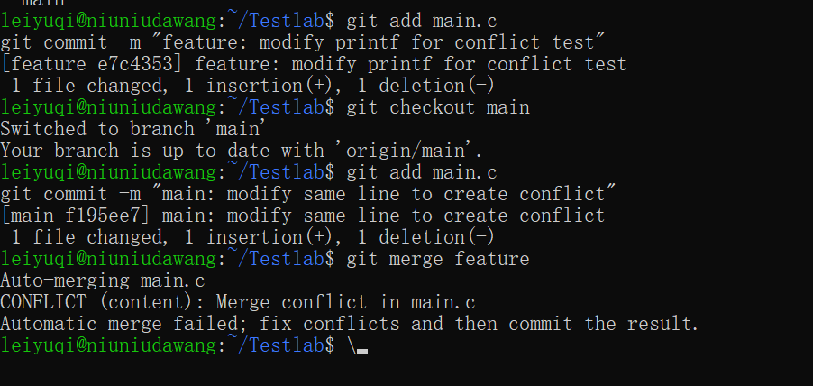
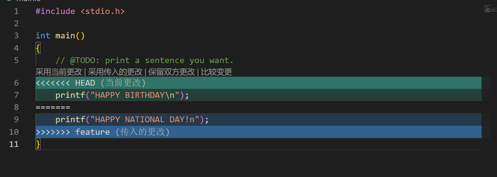
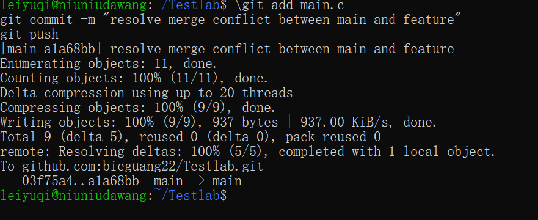

# <center> **Lab0 实验报告**</center>
<center> leiyuqi </center>

## 摘要
本实验完成git相关的基础操作，在本地实现clone远程仓库，修改提交代码，分支创建、切换、合并以及处理代码合并冲突等操作，掌握Git暂存、提交、分支隔离的基础原理。

## 实验步骤
1. 配置WSL环境下Git的用户名与邮箱身份信息
2. 从GitHub远程仓库克隆仓库到WSL本地
3. 在main分支修改main.c的TODO代码，完成git add、commit、push提交
4. 创建feature分支，修改main.c同一行代码并提交
5. 切回main分支，修改main.c**同一行**代码（内容与feature分支不同）并提交
6. 执行git merge feature合并分支，产生代码冲突，手动截图、解决冲突后提交推送

## 实验内容
+ 任务一：回答文档问题

**1. 你之前有过多人协同开发的经历吗？如果有，你们是使用什么方式分工协作的？**

> 有过。此前在曦源项目中参与过多人协同开发：我们使用 GitHub 组织仓库，约定每位成员在各自独立的 feature 分支上开发，互不干扰；完成后发起 Pull Request 并请其他成员进行代码审查，审查通过后再由负责人合并到 main 分支，合并前先 git pull 同步最新代码并处理冲突。通过分支隔离避免代码互相覆盖，通过代码审查保证合并质量。

**2. Git 为什么要设计"暂存-提交"两个步骤？**

Git 将改动提交分为"暂存（git add）"和"提交（git commit）"两个步骤，主要目的：

1. **精确控制提交内容**：可以挑选某一部分文件加入暂存区，而不是一次性提交所有改动，使每次提交聚焦于单一逻辑改动。
2. **组织清晰的提交历史**：先暂存、再检查、后提交，确保历史记录可读、可回溯，方便团队定位每次改动的意图。
3. **降低误操作风险**：改动在工作区尚未暂存时不影响版本历史，提交前可以反复确认，避免把不完整的代码写进历史记录。
4. **支持分支与协作**：暂存区充当工作区与版本库之间的缓冲，允许分阶段整合，配合分支机制实现多人并行开发。

**3. `git branch` 和 `git branch -a` 的区别是什么？**

先在终端分别运行`git branch`和`git branch -a`得到运行结果


|序号|`git branch`|`git branch -a`|
|-----|-----|-----|
|1|仅显示本地仓库中的所有分支|显示本地仓库和远程仓库中的所有分支|
|2|当前所在分支以`*`标记|远程分支以`remotes/origin/分支名`形式展示|
|3|不包含远程分支信息|同时列出本地+远程全部分支，方便对照本地与远程分支|

+ **任务二：克隆远程仓库，并在main分支上完成一次提交**

在main.c文件中TODO部分增添了如下代码
```c
printf("HAPPY NATIONAL HOLIDAY.\n");
```
使用`git add main.c`将main.c的修改加入暂存区，再执行`git commit -m "complete TODO in main.c"`打包本次改动，最后`git push`上传到GitHub远程仓库。运行结果如下图：


+ **任务三：阅读理解**

**阅读概括**
* **文章1：Commit Message 规范**
在使用`git commit`提交代码时，Git要求附带提交说明commit message。文章介绍规范提交信息的意义，约定式提交的结构：Header（type、scope、subject）、Body、Footer。规范的提交信息方便团队追溯修改意图，还可以借助工具自动生成更新日志Change Log；不规范的提交消息会让版本历史杂乱，多人协作时难以定位修改目的。

* **文章2：Git Flow分支控制**
GitFlow是一套成熟的团队分支管理规范，定义不同分支的用途：main为主线上永久分支、develop为开发分支，feature为临时功能分支。规定分支从哪里创建、合并回哪里，规范版本号命名与分支命名规则，用来规范多人并行开发，减少代码冲突，稳定管理软件版本。

**为什么要学习Git**
Git属于分布式版本控制系统，对比手动复制文件夹备份，Git可以记录每一行代码修改记录，记录修改人，随时回退历史版本，支持多人并行开发；手动备份版本容易丢失、分不清修改内容，无法协作。
对比SVN这类集中式版本管理工具，Git本地就保存完整仓库快照，断网也可以commit、创建分支，网络恢复后再push；SVN强依赖中央服务器，离线无法提交，分支操作开销大。
依托GitHub这类平台，Git可以实现代码云端托管、老师在线审阅代码，是现代软件工程团队协作的基础工具。

+ **任务四：完成git分支管理相关操作**

首先建立`feature`分支

在`feature`分支中修改main.c代码，并完成提交。

合并分支到`main`分支，使用`git checkout main`切回main分支，**修改同一行printf为不同文字**，提交，`git merge feature`尝试将feature分支的提交合并到main分支，触发冲突如图：




手动删除`<<<<<<< HEAD`、`=======`、`>>>>>>> feature`标记，修改代码，保存文件，add、commit、push完成冲突解决,如下图：


## 总结
本实验完成Git基础操作，包括配置身份、clone仓库、修改文件、暂存提交、创建分支、切换分支、合并分支并解决代码冲突。理解了Git工作区、暂存区、本地仓库的关系，理解分支隔离特性，学会了同一行代码修改造成合并冲突的现象与手动解决冲突的方法，掌握基础Git协作流程。
